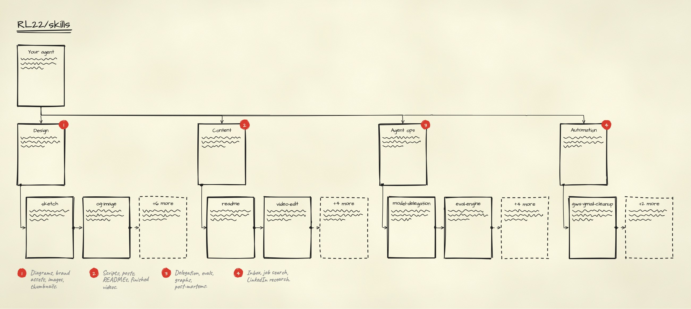

<div align="center">

# Skills

**23 self-authored skills that teach your coding agent to design, write, ship and run its own ops.**

Plain [Agent Skills](https://agentskills.io) folders: one `SKILL.md` each, no plugin runtime.
They work in Claude Code, Codex, Cursor, OpenCode and any agent that reads the standard.

[](LICENSE)
[](#skills)
[](https://agentskills.io)

[Skills](#skills) • [Quickstart](#quickstart) • [Configuration](#configuration) • [License](#license)



<sub>Drawn by <a href="sketch">sketch</a>, one of the skills below, from <a href=".github/hero.json">this short JSON spec</a>.</sub>

</div>

## Quickstart

Clone once, then link the skills you want into your agent's skills folder:

```bash
git clone https://github.com/RL22/skills.git
ln -s "$PWD/skills/sketch" ~/.claude/skills/sketch
```

Use `~/.agents/skills/` or your agent's own skills directory in place of `~/.claude/skills/` as needed.
Invoke a skill by name (`/sketch flow …`) or just describe the task; the agent picks it from its description.

> [!TIP]
> Link several at once: `for s in sketch og-image readme; do ln -s "$PWD/skills/$s" ~/.claude/skills/$s; done`

## Skills

### 1 · Design and visuals

| Skill | What it does |
| :--- | :--- |
| [`sketch`](sketch) | Hand-drawn, lo-fi UX deliverables from a JSON spec: flows, screens, component sheets, sitemaps, journey maps, traces of live pages, responsive sets. |
| [`og-image`](og-image/SKILL.md) | Open Graph / social preview cards (1200×630) from an atomic design system with `@vercel/og`. |
| [`programmatic-brand-assets`](programmatic-brand-assets/SKILL.md) | Logos, favicons, PWA and app icons from SVG, Canvas, p5.js or deterministic geometry. |
| [`img-gen`](img-gen/SKILL.md) | Create and edit images: photos, logos, banners. |
| [`img-brandkit`](img-brandkit/SKILL.md) | Brand-kit boards (3×3 and 2×3 identity grids, logo systems, visual decks), prompted and generated. |
| [`create-visuals`](create-visuals/SKILL.md) | Design rules and motion patterns for polished Remotion videos and animated graphics. |
| [`create-thumbnail`](create-thumbnail/SKILL.md) | YouTube thumbnail candidates: cut the subject out with rembg, then composite it. |
| [`virtual-staging`](virtual-staging/SKILL.md) | Real-estate virtual staging that keeps the original architecture intact across angles. |

### 2 · Content and writing

| Skill | What it does |
| :--- | :--- |
| [`readme`](readme) | READMEs written like landing pages in GitHub Flavored Markdown, plus an audit script that scores one. |
| [`writing-for-humans`](writing-for-humans/SKILL.md) | Draft, revise or review clear, specific, human-sounding writing. |
| [`content-ideas`](content-ideas/SKILL.md) | Scrape the creators you track, score what's performing, and turn it into ideas. |
| [`content-outline`](content-outline/SKILL.md) | A structured script outline from a YouTube URL, article, markdown file or raw idea. |
| [`video-edit`](video-edit/SKILL.md) | Raw footage to a published video: transcription, FFmpeg cuts, Remotion graphics. |
| [`elg-engine`](elg-engine/SKILL.md) | Social posts from git diffs, PRDs and changelogs, written from five perspectives. |

### 3 · Agent ops

| Skill | What it does |
| :--- | :--- |
| [`model-delegation`](model-delegation/SKILL.md) | Route work across the Gemini, GPT and Claude CLIs: bulk reads, live search, media, second-opinion reviews. |
| [`map-graph`](map-graph/SKILL.md) | Plan complex tasks as agent graphs (DAGs) with model tiers, state schemas and guardrails. |
| [`eval-engine`](eval-engine/SKILL.md) | Design and run agent evaluations, from binary verifiers to trace-mining improvement loops. |
| [`failure-ledger`](failure-ledger/SKILL.md) | Turn failed runs into root causes and standing rules in `AGENTS.md`. |
| [`absorb`](absorb/SKILL.md) | Pull patterns out of a video, article or thread and apply them to your own project. |
| [`skillvault`](skillvault/SKILL.md) | Keep one portable skills library as the source of truth, and vet new skills before adding them. |

### 4 · Automation

| Skill | What it does |
| :--- | :--- |
| [`gws-gmail-cleanup`](gws-gmail-cleanup/SKILL.md) | Audit Gmail storage with the Google Workspace CLI and clean it with rules you approve. |
| [`job-search-operator`](job-search-operator/SKILL.md) | Score job descriptions, tailor applications, and prepare outreach and interviews. |
| [`linkedin-scout`](linkedin-scout/SKILL.md) | Find people, jobs, companies and posts from your own logged-in LinkedIn session. |

## Dependencies between skills

Some skills call scripts in a sibling skill by relative path, so install them together:

- `img-brandkit` uses `model-delegation`.
- `job-search-operator` uses `linkedin-scout` (override with `JSB_LINKEDIN_SCOUT_CLI`).

`linkedin-scout` also needs `capt-chrome-agent`, which is **not in this repo**. Put it next to `linkedin-scout` in the same skills folder, or set `CAPT_CHROME_AGENT_DIR`. `absorb` uses it too, but only for dynamic or gated pages.

## Configuration

Most skills need nothing beyond the agent. These need a one-time setup:

<details>
<summary><b>sketch</b>: Node 20+ and a headless Chromium</summary>
<br>

```bash
cd skills/sketch
npm install && npx playwright-core install chromium
```

</details>

<details>
<summary><b>content-outline, video-edit, create-thumbnail, linkedin-scout</b>: working directories</summary>
<br>

`content-outline`, `video-edit` and `create-thumbnail` read `SPRINTZ_CONTENT_DIR`; `linkedin-scout` reads
`SPRINTZ_JOB_SEARCH_DIR`. Both default to folders under `~/Sprintz/`. Point them at your own directories:

```bash
export SPRINTZ_CONTENT_DIR="$HOME/content"
export SPRINTZ_JOB_SEARCH_DIR="$HOME/job-search"
```

</details>

> [!IMPORTANT]
> `linkedin-scout` automates a logged-in LinkedIn session. Review LinkedIn's terms and use it only on your own
> account and data. All fixtures in this repo are fictional.

## License

MIT; see [`LICENSE`](LICENSE). A skill's own `license:` frontmatter takes precedence: `elg-engine` is Apache-2.0.
`sketch` bundles rough.js (MIT) and three SIL OFL fonts, with their licenses in
[`sketch/scripts/vendor/`](sketch/scripts/vendor).
