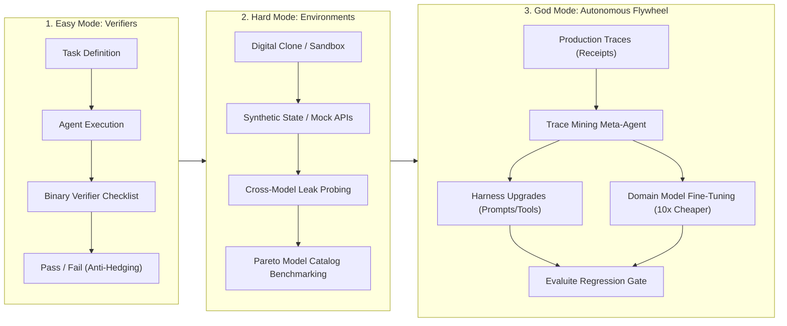

# Eval-Engine: The 3-Tier Agent Evaluation Framework

Transforms fuzzy agent outputs into verifiable engineering metrics. Bridges the progression from **deterministic binary verifiers** (Easy Mode) to **isolated digital clone sandboxes** (Hard Mode), up to **autonomous trace-mining self-improvement flywheels** (God Mode).

---

## The 3 Evolution Modes

---

## 5-Step Evaluation Protocol

Execute these 5 steps when designing or running agent evals:

### Step 1: Task Scope & Binary Deconstruction (Easy Mode)
1. Deconstruct the task into an explicit input payload and expected output state.
2. **Eliminate continuous 1–10 scoring scales**: Continuous scales cause LLM evaluators to hedge around 7–8 ("the middle problem").
3. Convert all evaluation criteria into an atomic checklist of strictly **binary (`True/False`) assertions**:
   - Programmatic state checks (e.g., database row updated, file created, exit code 0).
   - Structural constraints (e.g., exactly 3 paragraphs, JSON schema adherence, required tool called).
   - Semantic guardrails (e.g., absence of disallowed claims, mandatory disclaimers included).
4. Author or load the checklist per [`references/binary-rubric-guide.md`](references/binary-rubric-guide.md).

**Completion Criterion**: Rubric defined where 100% of evaluation items are strictly boolean with zero scalar floats.

---

### Step 2: Environment Sandbox & Digital Clone Setup (Hard Mode)
1. **Never test agents against live production systems**:
   - Agents under test must be completely isolated from live CRMs, production databases, and external messaging channels.
2. Construct a **Digital Clone** (containerized sandbox, mock APIs, or Docker fixture) per [`references/environment-sandbox-spec.md`](references/environment-sandbox-spec.md).
3. Seed the sandbox with synthetic or anonymized production snapshots.
4. **Cross-Model Heterogeneous Probing**:
   - Run a battery of disparate models (e.g., frontier reasoning model vs. compact open-weights model) across the environment.
   - If a compact or weaker model unexpectedly passes a scenario that stumped the frontier model, flag and audit the environment for **information leaks** (hidden answers in comments, unmasked metadata).

**Completion Criterion**: Sandbox provisioned with verified zero-live-credential access and leak audit validated.

---

### Step 3: Evaluite Assembly & Model Catalog Benchmarking
1. Group tasks into domain-tagged **Evaluites** (e.g., `software-engineering`, `gtm-research`, `code-review`).
2. Run candidate models against the tagged suite using `scripts/run_binary_eval.py`.
3. Compute the **Pareto Frontier** (Pass Rate vs. Latency vs. Cost per 1k runs):
   - Determine if a cheaper model (e.g. fast open-weights Tier 1) achieves an acceptable pass rate (e.g. 95% of frontier quality at 3x–10x lower cost).
   - Reserve expensive Tier 3 frontier models strictly for tasks failing cheaper tier thresholds.

**Completion Criterion**: Evaluite benchmark report generated detailing pass rates, token consumption, latency, and recommended production model tier binding.

---

### Step 4: Production Trace Capture & Trace Mining (God Mode)
1. **Log the Receipts**: Enable structured tracing across all production runs (capturing timestamp, user input, agent reasoning, every tool call input/output, and final response).
2. Deploy an asynchronous **Trace Mining Meta-Agent** per [`references/trace-mining-flywheel.md`](references/trace-mining-flywheel.md):
   - Periodically aggregate failed runs, high-latency traces, or negative user feedback.
   - Diagnose root causes: ambiguous prompt instructions, misconfigured tool schemas, or incorrect model tier selection.
3. Automatically generate a **Harness Remediation Proposal**:
   - Proposed diff to system prompts or tool descriptions.
   - Proposed fallback or retry policy.

**Completion Criterion**: Failure traces mined, root cause diagnosed, and concrete harness patch generated.

---

### Step 5: Evaluite Regression Gate & Human Approval
1. Run the proposed harness patch against the tagged Evaluite suite in the sandbox.
2. **Enforce the Regression Gate**:
   - Pass rate on new harness must be $\ge$ baseline across all existing tasks.
   - Targeted failure scenario must flip from `Fail` to `Pass`.
3. Present the diff, benchmark comparison, and failure analysis to the human operator for approval before merging into production.

**Completion Criterion**: Zero regression verified on existing evaluite tasks and explicit human sign-off recorded.

---

## Defensive Guardrails & Failure Modes

| Failure Mode | Root Cause | Mandatory Guardrail | Verification Criterion |
| :--- | :--- | :--- | :--- |
| **Score Hedging ("Middle Problem")** | 1–10 scalar scores cause LLM judges to cluster around 7–8, masking real defects. | **Binary Deconstruction Rule**: Every subjective requirement must be split into atomic boolean questions. | Verifier output schema accepts only boolean results; script asserts no ungrounded float ratings. |
| **Production State Pollution** | Testing directly on live environments corrupts user data or triggers unintended side effects. | **Digital Clone Isolation Gate**: Run strictly in ephemeral Docker/sandbox containers with synthetic state. | Pre-flight test harness check verifies zero production API keys or live endpoints in environment variables. |
| **Environment Leaks & Cheating** | Test environment contains subtle answer breadcrumbs, comments, or unstripped mocks. | **Cross-Model Probing**: Benchmark environments across multiple model families. | Automated flag raised if a lower-tier model outscores a frontier model on the same environment. |
| **Runaway Autonomous Drift** | Trace miners autonomously mutating prompts/tools without human boundaries, causing regression. | **Human Council & Evaluite Gate**: All harness modifications require passing the Evaluite regression gate and human approval. | CI gate blocks prompt/tool merge without test evidence and human sign-off. |

---

## Supporting References & Tooling

- **Binary Rubric Guide & Templates**: [`references/binary-rubric-guide.md`](references/binary-rubric-guide.md)
- **Environment & Sandbox Specification**: [`references/environment-sandbox-spec.md`](references/environment-sandbox-spec.md)
- **Trace-Mining Flywheel Architecture**: [`references/trace-mining-flywheel.md`](references/trace-mining-flywheel.md)
- **Binary Eval Runner CLI**: `python3 scripts/run_binary_eval.py`
