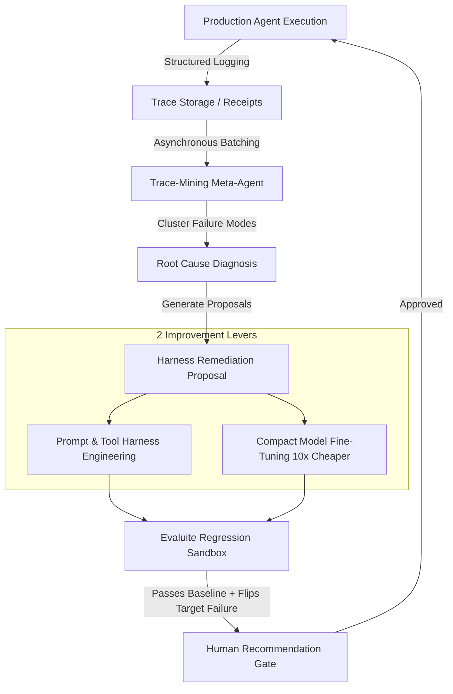

# Trace-Mining Flywheel & Autonomous Self-Improvement (God Mode)

God Mode represents the frontier of agent engineering: converting real-world production data into evaluation environments and automated harness upgrades, creating an autonomous self-improvement flywheel.

---

## 1. The Continuous Improvement Flywheel

---

## 2. Production Traces: The Receipts

You cannot reason about what autonomous agents will do in theory; you must observe what they do in practice.

A **production trace** is the comprehensive, immutable log of an agent's execution episode. Every trace must capture:
- `trace_id`: Unique episode identifier.
- `session_id`: User session or conversation thread.
- `input_context`: Raw user prompt and initial system state.
- `step_history`: Ordered array of:
  - Agent thought / internal monologue.
  - Tool invocations (tool name, exact JSON arguments).
  - Tool execution results (stdout, exit codes, API responses, errors).
- `final_output`: Deliverable presented to user or written to storage.
- `feedback_metadata`: Implicit signals (user accepted, edited, or re-prompted) or explicit ratings.

---

## 3. The Trace-Mining Meta-Agent

The Trace-Mining Meta-Agent is an asynchronous Tier 3 observer model that audits batches of execution traces to detect systemic failure patterns.

### Operational Responsibilities:
1. **Tool Failure Pattern Detection**:
   - Detects repeated invalid arguments, schema validation errors, or high tool retry counts.
   - Diagnoses whether the tool's JSON schema or docstring is confusing the operational agent.
2. **Instruction Leakage & Ambiguity Diagnosis**:
   - Identifies cases where the agent repeatedly deviates from company style guidelines or fails to find records due to vague documentation of database tables.
3. **Automated Remediation Proposals**:
   - Generates concrete, minimal git diffs modifying system prompts, tool schemas, or routing logic.

---

## 4. The Two Levers of Agent Improvement

### Lever A: Harness Engineering (Fast, Cheap, Immediate)
- Refine system prompt instructions with explicit negative constraints based on failure patterns.
- Clarify tool documentation and type schemas.
- Introduce deterministic pre-flight or post-flight validation scripts.

### Lever B: Compact Model Fine-Tuning (10x Cost Reduction)
When a narrow, high-volume production task (e.g., GTM CRM enrichment, customer email triage) is consistently solved by an expensive frontier model:
1. Extract 1,000–5,000 high-scoring production traces verified by binary rubrics.
2. Format the traces into fine-tuning instruction pairs.
3. Fine-tune a compact open-weights model (e.g., 7B–14B parameters).
4. Run the fine-tuned model against the tagged Evaluite: achieve equivalent domain accuracy at **10x lower inference cost and significantly lower latency**.

---

## 5. The Human Role Shift

In God Mode, the human engineer's time is freed from manual inspection and redirected to the highest-leverage responsibilities:
1. **Defining What Good Looks Like**: Authoring comprehensive binary rubrics and acceptance criteria.
2. **Environment Stewardship**: Designing authentic digital clone fixtures and updating edge cases.
3. **The Governance Gate**: Reviewing and approving automated harness diffs before production deployment.
