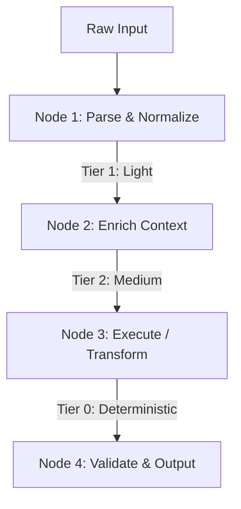
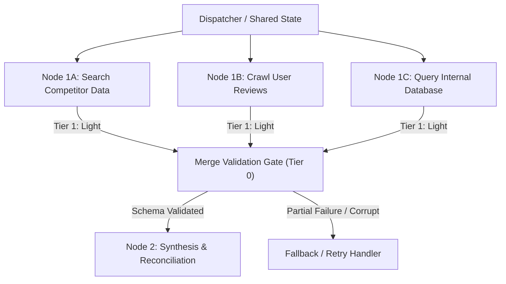
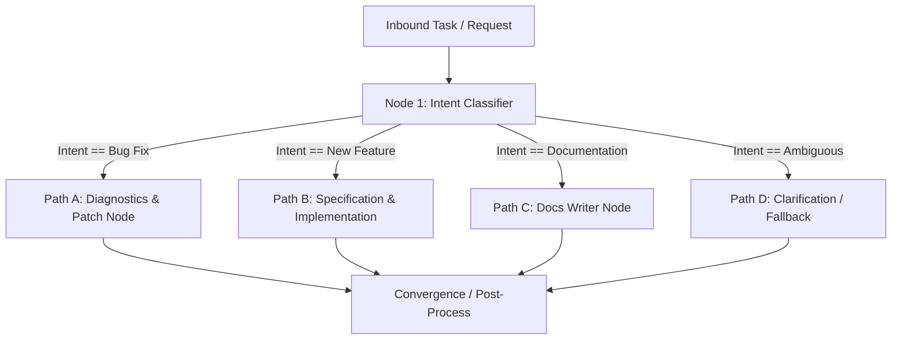
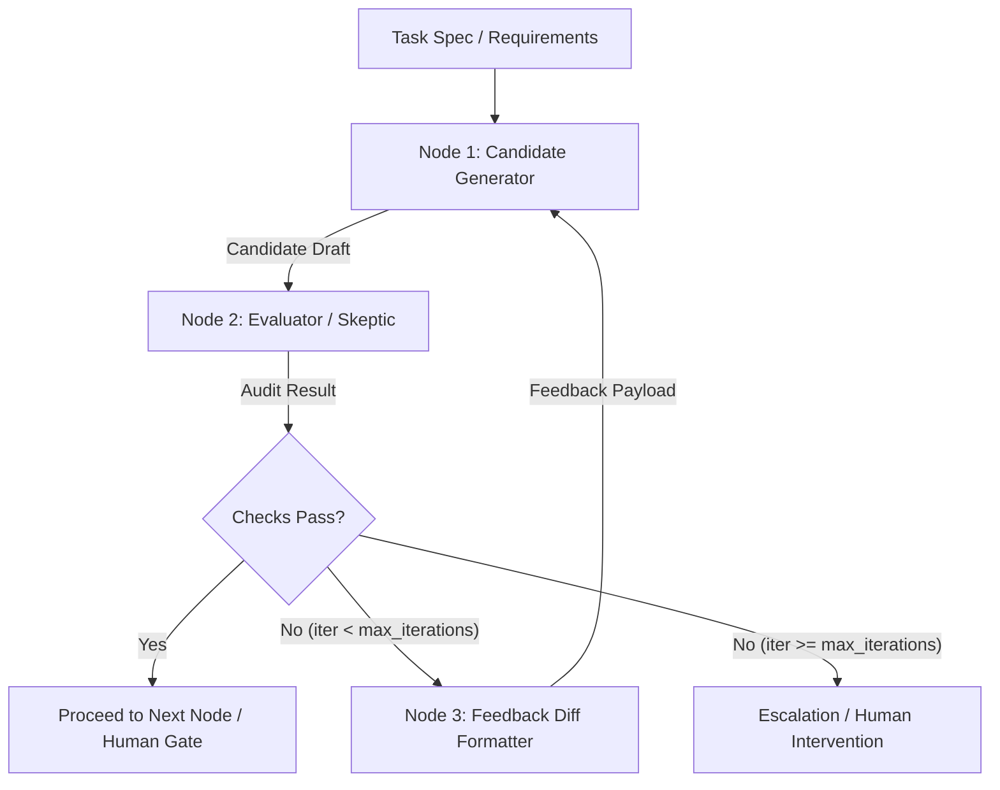
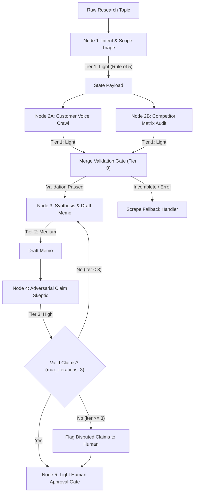
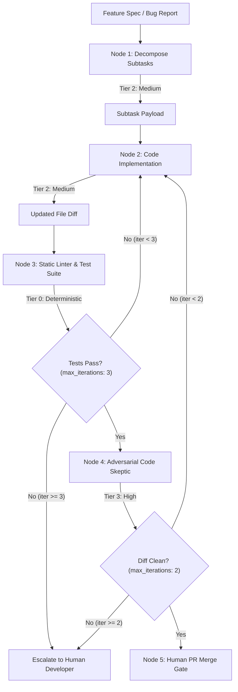
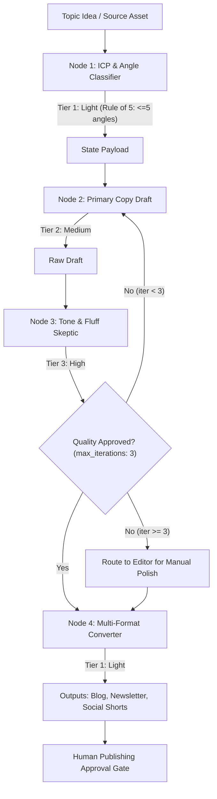
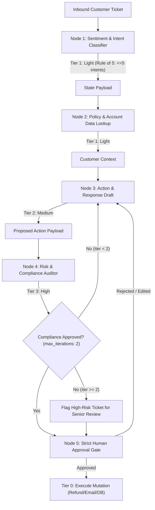

# Proven Agent Graph Patterns

Graph engineering bridges the gap between chaotic multi-turn prompting and deterministic software systems. Every production agent graph is composed of **four foundational building blocks**, which combine into specialized **domain archetypes**.

---

## Part 1: The 4 Foundational Building Blocks

All complex agent graphs decompose into four atomic topological primitives. Choose the simplest primitive that satisfies your requirements.

---

### 1. The Chain (Linear Baseline)

#### Purpose
Sequential execution where each node strictly consumes the output of its predecessor and transforms the shared state. It represents the baseline pattern with zero routing complexity and predictable execution flow.

#### Architecture

#### Optimal Use Cases
- Fixed-sequence deterministic pipelines (e.g., fetch raw data -> parse JSON -> format Markdown).
- Code scaffolding or template instantiation where dependencies are strictly ordered.
- Simple, low-ambiguity tasks where every stage is guaranteed to succeed.

#### Failure Modes & Brittleness
- **Single Point of Failure (SPOF)**: If any upstream node errors or produces a hallucinated output, subsequent nodes consume poisoned state, compounding errors down the chain.
- **Error Compounding**: Minor drift in early nodes becomes catastrophic divergence in final nodes.
- **Latency Accumulation**: Total latency is strictly the sum of all node latencies, making deep chains slow and rigid.

---

### 2. The Diamond (Parallel Fan-Out & Merge)

#### Purpose
Concurrent execution of two or more independent subtasks originating from a single state snapshot, converging into a synchronization and merge point. Drastically compresses wall-clock time while enriching context from multiple orthogonal perspectives.

#### Architecture

#### Optimal Use Cases
- Multi-source intelligence gathering (e.g., competitor audit + review sentiment + analytics query).
- Multi-perspective consensus or debate (e.g., legal review + security audit + developer DX review in parallel).
- Generating multiple distinct creative candidates or technical strategies simultaneously.

#### Failure Modes & Guardrails
- **False Independence**: Treating subtasks as parallelizable when hidden state dependencies or ordering constraints exist, leading to race conditions or inconsistent assumptions.
- **Silent Failures & Partial Branch Failure**: If one branch hangs, times out, or returns empty data, the merge node risks either deadlocking or synthesizing incomplete data without warning.
- **Mandatory Guardrail — Merge Validation Gate**: Never allow raw parallel outputs directly into a downstream synthesis node. Insert a deterministic validation gate (Tier 0 or lightweight Tier 1) that verifies schema compliance, freshness, and non-empty responses across all branches before triggering synthesis.

---

### 3. The Branch (Context / Skill Router)

#### Purpose
Conditional classification and dynamic routing. An upstream classifier inspects the input or intermediate state and routes execution to exactly one specialized sub-graph or skill, pruning irrelevant downstream execution paths.

#### Architecture

#### Optimal Use Cases
- Triage engines routing support requests by topic and urgency.
- Multi-agent dispatch systems routing user requests to specialized skills (e.g., coding vs. copywriting vs. financial analysis).
- Complexity-based model routing (directing simple queries to Tier 1 and complex architectural questions to Tier 3).

#### Failure Modes & Guardrails
- **Overengineering**: Introducing routing branches for minor variations that a single prompt or few-shot example could handle naturally.
- **Classification Drift**: Fuzzy boundaries between categories causing ambiguous inputs to misroute.
- **Mandatory Guardrail — The 'Rule of 5'**: A single routing node must NEVER route across more than 5 distinct downstream branches. When categorization exceeds 5 options, classification accuracy degrades sharply. Instead, decompose into a two-level hierarchical router (e.g., Domain Router -> Sub-specialty Router) or consolidate into broader categories with a fallback default.

---

### 4. The Loop (Evaluator-Optimizer)

#### Purpose
Iterative generation and validation. A generator node produces a candidate deliverable, which is evaluated against strict criteria by an evaluator node (either a deterministic test runner or an adversarial LLM skeptic). If validation fails, constructive feedback loops back to the generator for targeted refinement.

#### Architecture

#### Optimal Use Cases
- Test-driven code implementation (generate code -> run pytest/tsc -> fix failing tests).
- Iterative copywriting or design refinement against specific brand rubrics and constraints.
- Schema correction where generated JSON/YAML must pass strict Pydantic/Zod validation.

#### Failure Modes & Guardrails
- **Infinite Loop Token Burn**: The generator and evaluator become trapped in a non-converging argument (e.g., fixing issue A reintroduces issue B), burning API tokens and rate limits indefinitely.
- **Evaluator Hallucination**: An LLM evaluator hallucinating nonexistent flaws or providing conflicting instructions on alternating iterations.
- **Mandatory Guardrail — Enforced `max_iterations`**: Every loop MUST specify an immutable iteration counter (standard: `max_iterations: 3`, operational: `max_iterations: 2`). When the counter is exhausted, the loop must break immediately to an escalation node (e.g., human-in-the-loop triage or safe degraded exit). Never construct a loop without an explicit counter condition.

---

## Part 2: Proven Domain Archetypes

These 4 archetypes combine the foundational primitives with explicit model tier bindings, merge validation gates, Rule of 5 routers, and `max_iterations` guardrails.

---

### 1. The Diamond Pattern (Research & Analysis)
Combines **The Diamond** (parallel crawl & audit) with **The Loop** (adversarial verification) and a terminal **Human Gate**.

#### Guardrails Applied
- **Merge Validation Gate (Tier 0)**: Ensures both competitive and customer voice scrapers produced valid, non-empty markdown before synthesis.
- **Loop Bound (`max_iterations: 3`)**: Prevents perpetual claim debate between Node 3 and Node 4.
- **Rule of 5**: Node 1 scope triage is constrained to 3 research dimensions (Customer, Competitor, Regulatory).

---

### 2. The Test-Driven Coding Loop (Development)
Combines **The Chain** (task decomposition) with a dual-stage **Loop** (Tier 0 deterministic unit tests followed by Tier 3 adversarial code review).

#### Guardrails Applied
- **Deterministic First (Tier 0 before Tier 3)**: Never waste Tier 3 reasoning tokens on code that does not compile or fails basic unit tests.
- **Loop Bound on Test Runner (`max_iterations: 3`)**: Stops regression ping-pong if code generation is stuck.
- **Loop Bound on Skeptic (`max_iterations: 2`)**: Limits stylistic debate; unresolved issues escalate to human code review.

---

### 3. The Content & Growth Machine (Marketing)
Combines **The Branch** (audience & angle classifier) with **The Loop** (brand tone evaluation) and **The Chain** (multi-format derivation).

#### Guardrails Applied
- **Rule of 5 on Classifier**: Restricts audience angle classification to at most 5 distinct ICP segments (e.g., Founder, Engineer, Marketer, Operator, Executive).
- **Tone Loop Bound (`max_iterations: 3`)**: Halts subjective stylistic churn and hands off to human editor.
- **Downstream Fan-Out**: Multi-format converter only fires once the primary message has passed tone validation.

---

### 4. The High-Risk Operational Gate (Support & Refunds)
Combines **The Branch** (sentiment & intent classification) with strict **Tier 3 Compliance Audit** and an immutable **Human Approval Gate** prior to external mutations.

#### Guardrails Applied
- **Rule of 5 on Intent Triage**: Limits inbound triage categories to <= 5 paths (e.g., Billing/Refund, Tech Support, Account Access, Feature Request, Churn Prevention).
- **Compliance Loop Bound (`max_iterations: 2`)**: Highly constrained iterations for financial/legal compliance; immediately flags to senior operator if unresolved.
- **Deterministic Action Gate**: Model never directly mutates databases or triggers payments; Tier 0 worker executes only upon explicit human cryptographic/click sign-off.

