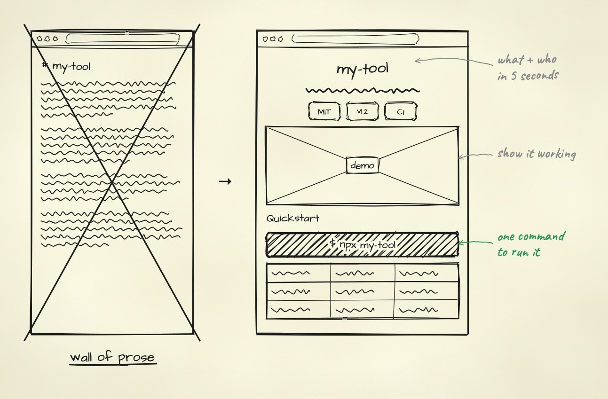

<div align="center">

# readme

**Turn a wall-of-text README into a page people read in five seconds and run in thirty.**

An agent skill that writes, redesigns and audits READMEs in GitHub Flavored Markdown,
using four proven project archetypes and a scoring script you can run in CI.

[](#license)
[](#audit-any-readme)
[](https://agentskills.io)

[Quickstart](#quickstart) • [What it knows](#what-it-knows) • [Audit](#audit-any-readme) • [License](#license)



<sub>Drawn with <a href="../sketch">sketch</a> from <a href="assets/hero.json">this spec</a>.</sub>

</div>

## Quickstart

Copy or symlink this folder into your agent's skills directory. No install step; the audit script needs only Python 3.

```text
/readme write a README for this repo
/readme audit README.md
/readme redesign README.md --template=cli
```

## What it knows

The agent follows six steps: pin down what the project is and who it's for, pick an archetype, build the
top of the page, frame the problem, add a quickstart, then close with proof and a license.

| Archetype | Leads with | Template |
| :--- | :--- | :--- |
| CLI / system tool | terminal recording, install matrix, command recipes | [`template-cli-tool.md`](assets/template-cli-tool.md) |
| SaaS / web app | problem cards, screenshot grid, self-hosting guide | [`template-saas-platform.md`](assets/template-saas-platform.md) |
| Library / SDK | 10-line code sample, benchmarks, API reference | [`template-library-framework.md`](assets/template-library-framework.md) |
| AI agent / pipeline | flow diagram, model support, tool registry, evals | [`template-ai-agent.md`](assets/template-ai-agent.md) |

It loads only the template it needs. The references cover the GitHub rendering details that are easy to get wrong:

- [`ghfm-syntax-matrix.md`](references/ghfm-syntax-matrix.md): dark/light images, HTML card grids, alerts, `<details>`, Mermaid.
- [`visual-assets-guide.md`](references/visual-assets-guide.md): `vhs` terminal recordings, media size budgets, badge systems.
- [`producthunt-launch-anatomy.md`](references/producthunt-launch-anatomy.md): taglines, launch badges, and benchmark claims people will believe.
- [`readme-archetypes.md`](references/readme-archetypes.md): the four archetypes in full.

## Audit any README

`scripts/audit-readme.py` scores a README out of 100 across five areas (top of page, quickstart, visuals,
GitHub craft, trust) and subtracts points for too many external image hosts, layout-shifting images
and template placeholders left unfilled. It reads one local file and makes no network calls.

```bash
python3 scripts/audit-readme.py path/to/README.md --verbose
python3 scripts/audit-readme.py path/to/README.md --producthunt   # launching? score the launch checks too
```

```text
=== GHFM README Audit Report (standard) ===
Overall Score: 89 / 100 (Raw: 89, Penalties: -0)
Above-the-Fold & Hero            : 25 / 25 pts
Frictionless Quickstart          : 20 / 20 pts
...
```

It exits 1 below `--threshold` (default 70), so it can gate a CI job. `--json` prints machine-readable results.

> [!NOTE]
> Product Hunt embeds and star-history charts are scored only with `--producthunt`. A project that isn't
> launching isn't marked down for leaving them out.

## License

MIT.
