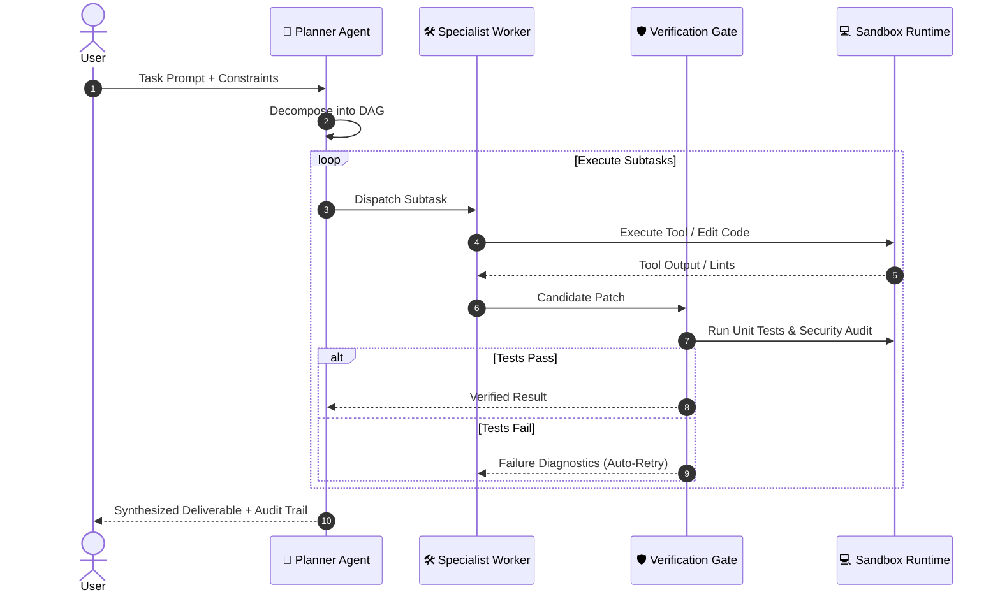

<div align="center">

<picture>
  <source media="(prefers-color-scheme: dark)" srcset="assets/agentflow-dark.svg">
  <source media="(prefers-color-scheme: light)" srcset="assets/agentflow-light.svg">
  
</picture>

# 🧠 AgentFlow

**Deterministic, multi-agent orchestration for mission-critical engineering workflows.**

Build, benchmark, and deploy self-healing AI agent swarms with typed tool protocols and budget guardrails.

<br>

<!-- Product Hunt Launch Widget -->
<a href="https://www.producthunt.com/posts/agentflow?embed=true&utm_source=badge-featured&utm_medium=badge&utm_campaign=badge-agentflow" target="_blank">
  
</a>

<br><br>

[](https://python.org)
[](https://github.com/owner/agentflow/stargazers)
[](https://swebench.com)
[](LICENSE)

<br>

[Docs](https://agentflow.dev) • [Architecture](#-architecture) • [Supported Models](#-model-support) • [Quickstart](#-quickstart) • [Discord](https://discord.gg/yourinvite)

</div>

---

## ⚡ Agent Lifecycle Flow



---

## 🎯 Key Capabilities

<table width="100%">
  <tr>
    <td width="33%" valign="top" align="center">
      <br>
      
      <h3 align="center">Model Tier Routing</h3>
      <p align="center">Intelligently routes trivial tasks to fast models (Gemini Flash / Haiku) and deep planning to frontier models.</p>
      <br>
    </td>
    <td width="33%" valign="top" align="center">
      <br>
      
      <h3 align="center">Circuit Breaker Caps</h3>
      <p align="center">Hard token limits, loop detection, and maximum spend ceilings prevent runaway agent loops.</p>
      <br>
    </td>
    <td width="33%" valign="top" align="center">
      <br>
      
      <h3 align="center">Native MCP Support</h3>
      <p align="center">Plug-and-play compatibility with any Model Context Protocol (MCP) server out of the box.</p>
      <br>
    </td>
  </tr>
</table>

---

## 🤖 Model Support Matrix

| Provider | Models Supported | Streaming | Function Calling | Vision / Multimodal |
| :--- | :--- | :---: | :---: | :---: |
| **Anthropic** | Claude 3.5 Sonnet, Haiku | :white_check_mark: | :white_check_mark: | :white_check_mark: |
| **OpenAI** | GPT-4o, o1, o3-mini | :white_check_mark: | :white_check_mark: | :white_check_mark: |
| **Google** | Gemini 2.0 Flash, Pro | :white_check_mark: | :white_check_mark: | :white_check_mark: |
| **Local / Ollama** | DeepSeek R1, Llama 3.3, Qwen 2.5 | :white_check_mark: | :white_check_mark: | :white_check_mark: |

---

## 🚀 Quickstart

Install via `pip` or `uv`:

```bash
pip install agentflow
```

Run an autonomous workflow:

```python
from agentflow import Swarm, Agent

# Define your specialist worker
worker = Agent(
    role="Backend Refactorer",
    model="claude-3-5-sonnet-latest",
    tools=["view_file", "replace_file_content", "run_tests"]
)

# Launch swarm
swarm = Swarm(leader="planner-v2", workers=[worker])
result = swarm.run("Audit auth middleware for race conditions and write tests.")

print(result.summary)
```

> [!NOTE]
> Ensure provider API keys (`ANTHROPIC_API_KEY`, `OPENAI_API_KEY`, `GEMINI_API_KEY`) are set in your local environment or `.env` file.

<details>
  <summary><b>🛠️ Advanced MCP Tool Server Configuration</b></summary>
  <br>

Configure external Model Context Protocol (MCP) tool servers in `agentflow.json`:

```json
{
  "mcpServers": {
    "github": {
      "command": "npx",
      "args": ["-y", "@modelcontextprotocol/server-github"],
      "env": { "GITHUB_PERSONAL_ACCESS_TOKEN": "ghp_..." }
    },
    "filesystem": {
      "command": "npx",
      "args": ["-y", "@modelcontextprotocol/server-filesystem", "/workspace"]
    }
  }
}
```

</details>

---

## 📊 Benchmark Results

> [!NOTE]
> **Evaluation Protocol**: Benchmarked against [SWE-bench Lite](https://www.swebench.com) (300 test instances, commit: `v1.0.2`).
> Driver model: `claude-3-5-sonnet-20241022`, max budget: 30 tool calls / instance. Pass@1 verified using clean Docker sandboxes.

| Framework | Resolution Rate (%) | Cost per Resolved Issue ($) | Average Time (s) |
| :--- | :---: | :---: | :---: |
| **`AgentFlow`** | **42.8%** (128/300) | **$0.48** | **94s** |
| `OpenDevin (v0.6)` | 26.2% (79/300) | $1.85 | 310s |
| `AutoGPT (v0.5)` | 14.1% (42/300) | $2.40 | 450s |

---

## 📈 Star History

<div align="center">
  <a href="https://star-history.com/#owner/agentflow&Date">
    <picture>
      <source media="(prefers-color-scheme: dark)" srcset="https://api.star-history.com/svg?repos=owner/agentflow&type=Date&theme=dark" />
      <source media="(prefers-color-scheme: light)" srcset="https://api.star-history.com/svg?repos=owner/agentflow&type=Date" />
      
    </picture>
  </a>
</div>

---

## 📄 License

Apache-2.0 © [AgentFlow Contributors](LICENSE)
