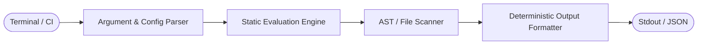

<div align="center">

# ⚡ your-cli

**The lightning-fast command-line tool for modern developers.**

One-sentence description explaining the exact pain point resolved and the core technical advantage.

<br>

<!-- Product Hunt Launch Widget -->
<a href="https://www.producthunt.com/posts/your-cli?embed=true&utm_source=badge-featured&utm_medium=badge&utm_campaign=badge-your-cli" target="_blank">
  
</a>

<br><br>

[](https://github.com/owner/your-cli/releases)
[](https://github.com/owner/your-cli/stargazers)
[](LICENSE)
[](https://github.com/owner/your-cli)

<br>

[Install](#-installation) • [Quickstart](#-quickstart) • [Recipes](#-common-recipes) • [Configuration](#-configuration) • [Discord](https://discord.gg/yourinvite)

<br>

<picture>
  <source media="(prefers-color-scheme: dark)" srcset="assets/demo-dark.gif">
  <source media="(prefers-color-scheme: light)" srcset="assets/demo-light.gif">
  
</picture>

</div>

---

## 🎯 Why your-cli?

<table width="100%">
  <tr>
    <td width="33%" valign="top" align="center">
      <br>
      
      <h3 align="center">Zero Startup Latency</h3>
      <p align="center">Compiled to a single native binary. Cold boots in under 5ms with bounded memory allocation.</p>
      <br>
    </td>
    <td width="33%" valign="top" align="center">
      <br>
      
      <h3 align="center">Zero Configuration</h3>
      <p align="center">Auto-detects project structure and defaults to secure, production-tested presets.</p>
      <br>
    </td>
    <td width="33%" valign="top" align="center">
      <br>
      
      <h3 align="center">Pipeline Ready</h3>
      <p align="center">Native JSON output and standard exit codes built for painless CI/CD scripting.</p>
      <br>
    </td>
  </tr>
</table>

---

## 📦 Installation

Install `your-cli` in seconds via your preferred package manager:

### macOS (Homebrew)
```bash
brew install owner/tap/your-cli
```

### Linux (Shell script)
```bash
curl -fsSL https://your-cli.sh/install | sh
```

### Python (pipx)
```bash
pipx install your-cli
```

### Rust (Cargo)
```bash
cargo install your-cli
```

---

## 🚀 Quickstart

Initialize and run your first job in 30 seconds:

```bash
# 1. Initialize configuration
your-cli init

# 2. Run analysis on current directory
your-cli analyze --output json

# 3. Apply automated fixes
your-cli fix --dry-run
```

> [!TIP]
> Add `eval "$(your-cli completion zsh)"` to your `~/.zshrc` for instant tab autocompletion.

---

## 📖 Common Recipes

<details>
  <summary><b>🔍 Recipe 1: Continuous Background Watch Mode</b></summary>
  <br>

Run in watch mode to automatically trigger checks on file changes:

```bash
your-cli watch --path ./src --debounce 250ms
```
</details>

<details>
  <summary><b>🤖 Recipe 2: GitHub Actions CI Integration</b></summary>
  <br>

Add this step to `.github/workflows/ci.yml`:

```yaml
- name: Run your-cli Check
  run: |
    curl -fsSL https://your-cli.sh/install | sh
    your-cli check --strict
```
</details>

---

## 🏛️ Architecture & Execution Flow



---

## ⚙️ Configuration

| Flag | Shorthand | Type | Default | Description |
| :--- | :---: | :--- | :--- | :--- |
| `--config` | `-c` | `string` | `~/.config/your-cli/config.toml` | Explicit path to config file |
| `--format` | `-f` | `string` | `table` | Output format (`table`, `json`, `yaml`) |
| `--verbose` | `-v` | `boolean` | `false` | Enable detailed debug trace logging |
| `--strict` | `-s` | `boolean` | `true` | Exit with error code 1 on rule violation |

`your-cli` looks for a configuration file at `~/.config/your-cli/config.toml` or `./.your-clirc`:

```toml
[general]
verbose = false
concurrency = 8
format = "table"

[rules]
strict_mode = true
ignore_patterns = [".git", "node_modules", "dist"]
```

---

## 🤝 Community & Support

- Star the repo to track updates!
- Join our [Discord community](https://discord.gg/yourinvite) for support and feature discussions.
- Report bugs or submit feature requests on [GitHub Issues](https://github.com/owner/your-cli/issues).

---

## 📄 License

Distributed under the MIT License. See [`LICENSE`](LICENSE) for more information.
