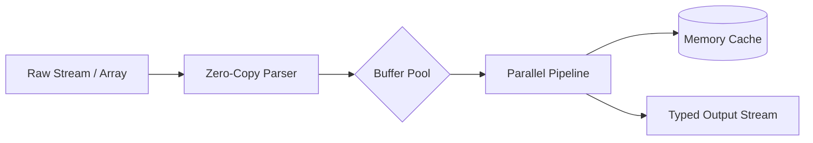

<div align="center">

<picture>
  <source media="(prefers-color-scheme: dark)" srcset="assets/banner-dark.svg">
  <source media="(prefers-color-scheme: light)" srcset="assets/banner-light.svg">
  
</picture>

# 📦 your-library

**The ultra-lightweight, zero-dependency engine for high-performance data transforms.**

High-throughput streaming with deterministic memory consumption and 100% strict TypeScript types.

<br>

<!-- Product Hunt Launch Widget -->
<a href="https://www.producthunt.com/posts/your-library?embed=true&utm_source=badge-featured&utm_medium=badge&utm_campaign=badge-your-library" target="_blank">
  
</a>

<br><br>

[](https://www.npmjs.com/package/your-library)
[](https://bundlephobia.com/package/your-library)
[](https://codecov.io/gh/owner/your-library)
[](LICENSE)

<br>

[Documentation](https://docs.your-library.org) • [Benchmarks](#-benchmarks) • [Architecture](#-architecture) • [API Reference](#-api-quick-reference) • [Installation](#-installation)

</div>

---

## ⚡ 10-Second Showcase

Solve complex data pipelines in a single declarative expression:

```typescript
import { createEngine } from "your-library";

// Initialize engine with zero boilerplate
const engine = createEngine({ strict: true, cache: "memory" });

// Transform and stream records in real time
const result = await engine.process({
  input: "raw-data-stream",
  transforms: ["normalize", "dedup", "enrich"],
});

console.log(result.summary);
// => { status: "success", processed: 10420, durationMs: 4.2 }
```

> [!TIP]
> `your-library` is tree-shakeable: importing individual transform functions only adds ~400 bytes to your client bundle.

---

## 💡 Architectural Tenets

<table width="100%">
  <tr>
    <td width="33%" valign="top" align="center">
      <br>
      
      <h3 align="center">Zero Dependencies</h3>
      <p align="center">Under 2KB minified + gzipped. Zero third-party packages or supply-chain vulnerabilities.</p>
      <br>
    </td>
    <td width="33%" valign="top" align="center">
      <br>
      
      <h3 align="center">Strict Typing</h3>
      <p align="center">Written in TypeScript 5.5+ with full generic type inference, branded types, and autocomplete.</p>
      <br>
    </td>
    <td width="33%" valign="top" align="center">
      <br>
      
      <h3 align="center">Ultra High Speed</h3>
      <p align="center">Processes over 1.2M records/sec using native typed arrays and pre-allocated buffer pools.</p>
      <br>
    </td>
  </tr>
</table>

---

## 🏛️ Architecture



---

## 📦 Installation

```bash
# npm
npm install your-library

# pnpm
pnpm add your-library

# yarn
yarn add your-library

# bun
bun add your-library
```

---

## 📊 Benchmarks

> [!NOTE]
> **Reproduction Harness**: Benchmark suite committed at [`/benchmarks/suite.ts`](benchmarks/suite.ts) (Git commit: `abc1234`).
> Executed on Apple M3 Pro (36GB RAM, macOS 14.5) with Node.js v22.4.1. Average of 10 warmup runs and 50 measured trials (median ± dispersion).

| Library | Version | Operations / sec (median) | Bundle Size (Min+Gzip) | Dependencies |
| :--- | :---: | :---: | :---: | :---: |
| **`your-library`** | `1.0.0` | **1,240,000 ops/s** (±1.2%) 🚀 | **1.8 KB** | **0** |
| `legacy-alternative-a` | `3.4.1` | 420,000 ops/s (±3.8%) | 28.4 KB | 14 |
| `legacy-alternative-b` | `2.1.0` | 210,000 ops/s (±4.5%) | 54.1 KB | 32 |

---

## 📚 API Quick Reference

<details>
  <summary><b><code>createEngine(options?: EngineConfig): Engine</code></b></summary>
  <br>

Instantiates a new processing engine with the provided options.

```typescript
interface EngineConfig {
  strict?: boolean;       // Throws errors on malformed records (default: false)
  concurrency?: number;   // Maximum concurrent task pool size (default: 4)
  cache?: "memory" | "disk" | "none"; // Caching tier
}
```
</details>

<details>
  <summary><b><code>engine.process(payload: ProcessPayload): Promise&lt;ProcessResult&gt;</code></b></summary>
  <br>

Processes incoming data payload and returns structured execution metrics.
</details>

---

## 📈 Star History

<div align="center">
  <a href="https://star-history.com/#owner/your-library&Date">
    <picture>
      <source media="(prefers-color-scheme: dark)" srcset="https://api.star-history.com/svg?repos=owner/your-library&type=Date&theme=dark" />
      <source media="(prefers-color-scheme: light)" srcset="https://api.star-history.com/svg?repos=owner/your-library&type=Date" />
      
    </picture>
  </a>
</div>

---

## 🤝 Contributing

We welcome contributions! Please review [`CONTRIBUTING.md`](CONTRIBUTING.md) to set up your local development environment and run tests:

```bash
pnpm install
pnpm test
```

---

## 📄 License

MIT © [Your Name / Organization](https://github.com/owner)
