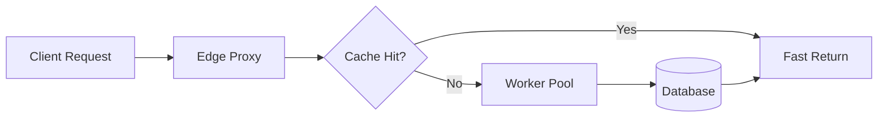

# GHFM Syntax & Visual Design Matrix

GitHub Flavored Markdown (GHFM) renders standard CommonMark alongside an extensive set of HTML5 tags and GitHub-specific extensions. This reference documents proven techniques for building designer-grade repository pages.

---

## 1. Theme-Adaptive Media (Dark Mode & Light Mode)

GitHub users dynamically switch between Light, Dark, and Dark High Contrast themes. Hardcoded dark or light assets often become unreadable.

### Method A: HTML5 `<picture>` Element (Recommended)
This is the most robust and standards-compliant way to render theme-aware banners and diagrams:

```html
<picture>
  <source media="(prefers-color-scheme: dark)" srcset="assets/banner-dark.svg">
  <source media="(prefers-color-scheme: light)" srcset="assets/banner-light.svg">
  
</picture>
```

### Method B: Markdown Fragment Identifiers
GitHub natively supports URL hash selectors for simple markdown images:

```markdown


```

---

## 2. Dynamic Vector Icons via Iconify CDN

Rather than bundling dozens of custom SVG files in your repository, load icons dynamically using the Iconify CDN directly in markdown `` tags.

### Syntax
```html

```

### Popular Icon Sets & Examples
- **Lucide Icons**:
  - Rocket: ``
  - Shield Check: ``
  - Zap: ``
  - Terminal: ``
- **Simple Icons (Brand logos)**:
  - Docker: ``
  - Python: ``

---

## 3. 3-Column HTML Card Grids (Feature & Problem Grids)

Standard markdown tables lack control over column widths and padding. Use styled HTML tables for crisp feature cards and problem/solution comparisons:

```html
<table width="100%">
  <tr>
    <td width="33%" valign="top" align="center">
      <br>
      
      <h3 align="center">Instant Startup</h3>
      <p align="center">Boot in under 5ms with zero warmup overhead or background daemons.</p>
      <br>
    </td>
    <td width="33%" valign="top" align="center">
      <br>
      
      <h3 align="center">Zero Dependencies</h3>
      <p align="center">Single static binary compiled with zero dynamic linking or runtime requirements.</p>
      <br>
    </td>
    <td width="33%" valign="top" align="center">
      <br>
      
      <h3 align="center">Air-Gapped Privacy</h3>
      <p align="center">100% local processing. No telemetry, external phone-homes, or analytics.</p>
      <br>
    </td>
  </tr>
</table>
```

---

## 4. GitHub Native Alerts (Callouts)

GitHub renders structured callout blocks styled with distinctive icons and colors:

```markdown
> [!NOTE]
> Highlights information that users should take into account, even when skimming.

> [!TIP]
> Optional advice or shortcuts to help users be more successful.

> [!IMPORTANT]
> Crucial information necessary for users to succeed.

> [!WARNING]
> Critical content demanding immediate user attention to avoid risks.

> [!CAUTION]
> Negative potential consequences of an action, such as data destruction.
```

---

## 5. Collapsible Accordions (`<details>` & `<summary>`)

Keep the primary flow lean and readable while preserving deep technical reference, benchmarks, and advanced configuration options:

```html
<details>
  <summary><b>🔧 Advanced CLI Configuration Options</b></summary>
  <br>

| Flag | Type | Default | Description |
| :--- | :--- | :--- | :--- |
| `--concurrency` | integer | `4` | Maximum parallel worker threads |
| `--timeout` | duration | `30s` | Network request timeout threshold |
| `--cache-dir` | string | `~/.cache` | Path to persistent disk cache |

</details>
```

---

## 6. Centered Hero Alignments

For header sections, use `<div align="center">` or `<p align="center">` to achieve polished, symmetrical landing page aesthetics:

```html
<div align="center">

# Project Name

**One-line value proposition in bold.**

A secondary explanatory sentence describing the core technical innovation and target audience.

<br>

[](https://github.com/owner/repo/stargazers)
[](LICENSE)
[](https://discord.gg/yourinvite)

<br>

[Website](https://example.com) • [Documentation](https://docs.example.com) • [Quickstart](#quickstart) • [Discord](https://discord.gg/yourinvite)

</div>
```

---

## 7. Keyboard Navigation & UI Keys (`<kbd>`)

When documenting keyboard shortcuts, render native keycaps using the `<kbd>` element:

```markdown
Press <kbd>Ctrl</kbd> + <kbd>Shift</kbd> + <kbd>P</kbd> to open the Command Palette, or <kbd>Esc</kbd> to dismiss.
```

---

## 8. Interactive Task Lists & Checklists

Track roadmaps or feature support cleanly:

```markdown
- [x] Native macOS Apple Silicon support
- [x] Cross-compilation to Linux ARM64
- [ ] Windows PowerShell tab completion *(in progress)*
- [ ] Enterprise SSO integration
```

---

## 9. Mermaid.js Native Diagrams

GitHub natively renders Mermaid.js diagrams directly in README files:

````markdown

````
