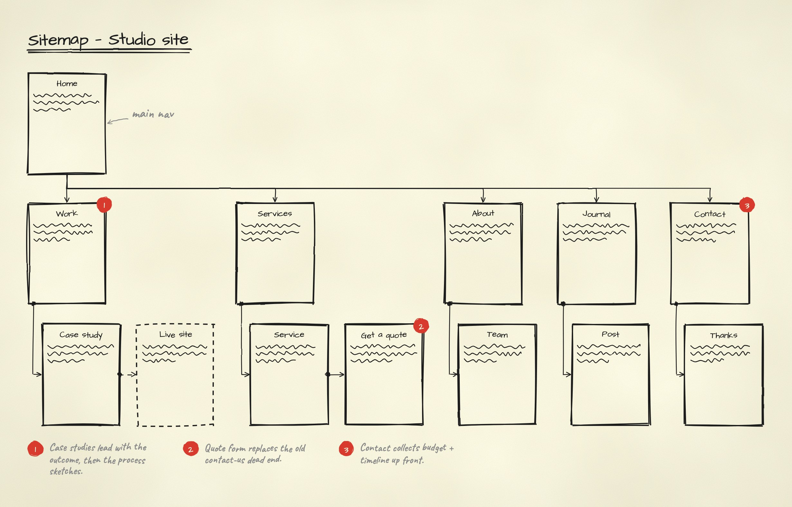
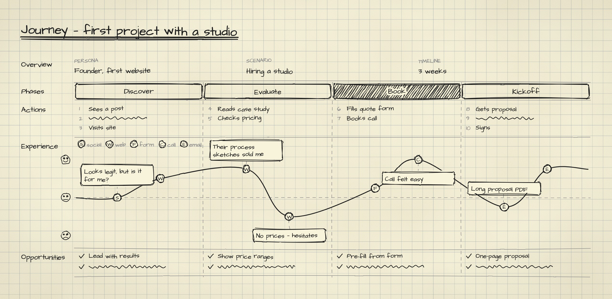
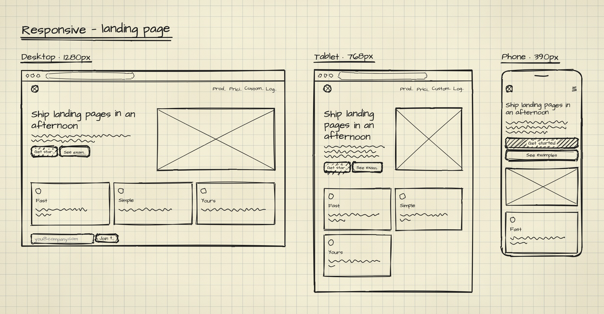
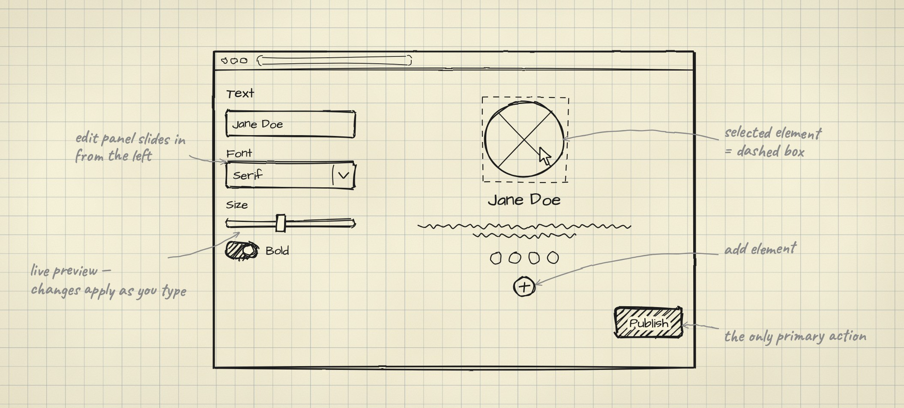
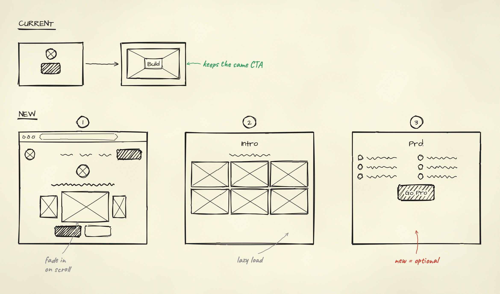

<div align="center">

# sketch

**Hand-drawn wireframes, flows and UX maps from one sentence to your coding agent.**

Your agent writes a small JSON spec. A seeded renderer draws it like black felt-tip on cream paper,
so the same spec always gives you the same image.

[](#credits-and-license)
[](#quickstart)
[](https://agentskills.io)

[Gallery](#gallery) • [Quickstart](#quickstart) • [Commands](#commands) • [How it works](#how-it-works)


</div>

## Quickstart

Copy or symlink this folder into your agent's skills directory, then install the renderer once:

```bash
npm install && npx playwright-core install chromium
```

Then ask your agent:

```text
/sketch flow — signup for a scheduling app: landing, pick a plan, create account, onboarding
```

## Gallery

<table>
  <tr>
    <td width="50%" valign="top"><br><b>sitemap</b>: page thumbnails in a tree, badges explained in a legend</td>
    <td width="50%" valign="top"><br><b>journey</b>: phases, actions, an emotion curve and the opportunities it shows</td>
  </tr>
  <tr>
    <td width="50%" valign="top"><br><b>iterate</b>: option A vs B, the loser struck out with its verdict</td>
    <td width="50%" valign="top"><br><b>responsive</b>: one page at desktop, tablet and phone</td>
  </tr>
  <tr>
    <td width="50%" valign="top"><br><b>screen</b>: one screen, every part labelled in the margin</td>
    <td width="50%" valign="top"><br><b>redesign</b>: CURRENT vs NEW, rationale in the margins</td>
  </tr>
</table>

Flows and sitemaps can use any of 42 ready-made page archetypes (pricing, checkout, dashboard, calendar…) as thumbnails:


## Commands

| Command | You get |
| :--- | :--- |
| `flow` | a user journey: screens left to right, curved arrows, numbered steps |
| `screen` | one screen up close, every part explained in the margin |
| `sheet` | a component library page |
| `iterate` | option A vs B, the rejected one struck out, the refined one drawn larger |
| `redesign` | CURRENT vs NEW rows with the rationale in the margins |
| `sitemap` | page thumbnails in a tree, numbered badges and a legend |
| `journey` | a customer journey map: phases, actions, emotion curve, touchpoints, opportunities |
| `trace` | any live page redrawn as a wireframe, compiled from a frozen snapshot by fixed rules |
| `responsive` | one page at desktop, tablet and phone, side by side |
| `photo` | a finished sketch turned into a photo of a notebook page (optional; needs an image model) |

More prompts:

```text
/sketch sitemap for a design studio site; badge the pages we're adding and explain why
/sketch journey — first-time buyer, 4 phases, the low point is shipping costs at checkout
/sketch trace https://example.com, then responsive
```

## How it works

1. **Spec, not pixels.** The agent writes JSON in a fixed sketch grammar: hatching marks the primary action,
   squiggles stand in for copy, an X-box is an image, dashed means empty or "add here".
2. **Deterministic render.** [rough.js](https://roughjs.com) runs with a seeded RNG in headless Chromium, using real
   font metrics. Same spec and seed, byte-identical image.
3. **Look, then fix.** The agent reads its own render, walks a 12-item checklist, and re-renders until the page
   is clean (at most three passes).

> [!TIP]
> `trace` is the fastest start for a redesign: snapshot the live page once, then every re-render is offline and repeatable.

<details>
<summary><b>Command-line use</b>: render, trace and test without an agent</summary>
<br>

```bash
node scripts/render.mjs examples/flow.json -o flow.png --strict     # .png · .jpg · .svg
node scripts/snapshot.mjs https://example.com -o home.snap.json      # trace: capture once…
node scripts/trace.mjs home.snap.json -o home.json                   # …compile by fixed rules
node scripts/responsive.mjs https://example.com -o out/home          # three widths, one board
npm test                                                             # determinism + layout checks
```

Every field and component is documented in [`references/spec-schema.md`](references/spec-schema.md).

</details>

## Credits and license

MIT. The style is inspired by the planning notes AJ shared in
[The Making of Carrd](https://themakingof.carrd.co/#extras-notes). It is drawn from scratch, and no reference
images are included. Bundles [rough.js](https://roughjs.com) (MIT) and the Architects Daughter, Caveat and Nanum
Pen Script fonts (SIL OFL 1.1); their licenses are in [`scripts/vendor/`](scripts/vendor).
